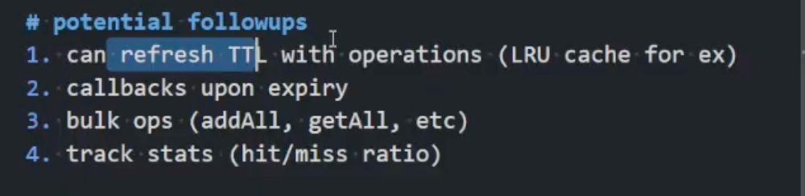

# Key Features
1. We store (expiration_time, key, value) tuples in the heap. When updating the dictionary, we validate that heap entries match dictionary entries before deletion, preventing premature removal of updated keys.
2. As an alternative, We could also implement an `entry_id` so that every single entry could have their own unique id so that we won't delete the unmatching ids.

# Threads
[] DO MORE RESEARCH ON THREAD
1. **Locking contention leading to staleness**

# Things to notice and discuss
1. The tradeoff between cleanup frequency and data consistency: 
1. The tradeoff between performance and data availability.
1. The lifecycle of a product: how does the user call these functions and how often. To let me better understand the when the best cleanup time is

executors for the callback?

